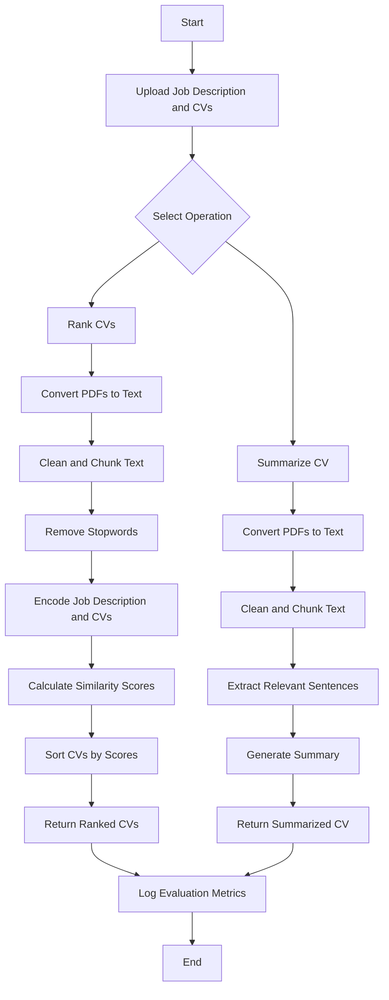

# Resume Ranking and Summarization Tool

This project provides a tool to rank and summarize CVs based on a given job description. The application is built using FastAPI for the backend, with endpoints for ranking and summarizing CVs. It also includes evaluation metrics such as MRR, NDCG, and BERTScore for performance measurement.

## Features

- **CV Ranking**: Rank CVs based on their relevance to a job description.
- **CV Summarization**: Summarize CVs to highlight relevant skills and experiences.
- **Evaluation Metrics**: Measure the performance of the ranking and summarization processes using MRR, NDCG, and BERTScore.

## Prerequisites

Before setting up the project, ensure you have the following installed:

- Python 3.7+
- pip
- Git

## Installation

1. **Clone the Repository:**

   ```bash
   git clone https://github.com/Greyisheep/resume-ranking-assessment.git
   cd resume-ranking-assessment
   ```

2. **Create and Activate a Virtual Environment:**

   ```bash
   python -m venv env
   source env/bin/activate  # On Windows: env\Scripts\activate
   ```

3. **Install the Required Dependencies:**

   ```bash
   pip install -r requirements.txt
   ```

## Running the Application

1. **Start the FastAPI Application:**

   ```bash
   uvicorn app.main:app --reload
   ```

2. **Access the API Documentation:**

   Open your browser and navigate to `http://127.0.0.1:8000/docs` to access the automatically generated API documentation.

3. **Use the Endpoints:**

   - **/rank**: Rank CVs based on a job description.
   - **/summarize**: Summarize a CV based on a job description.
  
4. **Start the Streamlit Application:**

   ```bash
   streamlit run app.py
   ```

## Project Structure

```plaintext
resume-ranking-assessment/
│
├── backend/
│   ├── __init__.py
|   ├── Dockerfile
│   ├── models.py           # Contains the models and functions for ranking and summarization
│   ├── main.py             # Entry point for the FastAPI application
│   ├── utils.py            # Utility functions for processing PDF files
|   ├── metrics.py          # Functions for calculating and logging evaluation metrics
│   └── requirements.txt   # Backend dependencies
├── frontend/
|   ├── Dockerfile
|   ├── app.py              # Streamlit frontend
│   └── requirements.txt    # Frontend dependencies
├── docker-compose.yml
└── README.md               # Project documentation
```

## Process Flow Diagram

The diagram below illustrates the detailed process flow of the application, from receiving a request to returning the ranked or summarized CVs.



## Reason for Choice of Models:

###  `sshleifer/distilbart-cnn-12-6` (for CV Summarization)
### Pros:
1. **Efficiency**: `sshleifer/distilbart-cnn-12-6` is a distilled version of BART, which makes it smaller and faster than the original BART model (`facebook/bart-large-cnn`). This can lead to quicker inference times, especially beneficial when processing multiple CVs.

2. **Good Performance**: Despite being a distilled model, `distilbart-cnn-12-6` retains much of the performance of its larger counterpart. It can generate coherent and relevant summaries, which is crucial for summarizing CVs effectively.

3. **Reduced Resource Consumption**: The model requires less memory and computational power, making it easier to deploy in environments with limited resources or when scaling the application to handle many users simultaneously.

4. **Compatibility with Hugging Face's Pipeline**: The model is easily integrable with Hugging Face's pipeline, allowing for straightforward implementation and fine-tuning if necessary.

### Cons:
1. **Limited Capacity**: As a smaller model, `distilbart-cnn-12-6` may not capture as much context or nuance as the full-sized BART model. This might lead to less detailed or accurate summaries, especially with complex or long CVs.

2. **Potential for Truncation**: The model's input token limit (1024 tokens) might still be an issue for longer CVs, leading to truncation and potentially missing important information in the summaries. This is a trade-off between efficiency and coverage.

3. **Reduced Flexibility in Summarization**: While the model is generally good at summarization, it might struggle with highly technical or domain-specific language present in CVs, which could result in less relevant summaries compared to a larger model fine-tuned specifically for this task.

### `sentence-transformers/msmarco-distilbert-base-v4` (for CV Ranking)
#### Pros:
1. **Efficiency**: DistilBERT-based models like `msmarco-distilbert-base-v4` are lightweight and faster compared to larger models, making them suitable for applications where speed is critical.
2. **Pre-trained on Relevant Data**: The `msmarco-distilbert-base-v4` model is fine-tuned on the MS MARCO dataset, which is designed for question-answering and information retrieval tasks. This makes it effective in ranking CVs based on similarity to a job description.
3. **Good Accuracy**: Despite being lightweight, this model provides a good balance between accuracy and computational efficiency for ranking tasks.

#### Cons:
1. **Limited Expressiveness**: As a distilled model, it may lack some of the nuanced understanding that larger, more complex models can provide, especially in cases requiring deep semantic comprehension.
2. **Potential for Missing Context**: While good for short queries, the model might struggle with capturing the full context of longer job descriptions or CVs.

## Other Options Considered and Reason for not going with them:
### **1. Ranking Alternative: `sentence-transformers/all-mpnet-base-v2`**
#### **Cons:**
- It requires more resources than `distilbert` models.
- The model is larger in size, which might lead to slightly longer processing times and higher memory usage compared to `distilbert`.

### **2. Summarization Alternative: `facebook/bart-large-cnn`**
#### **Cons:**
- `facebook/bart-large-cnn` has a maximum token limit (usually 1024 tokens), which can be a significant limitation when dealing with long CVs. This requires chunking the text, which might lead to loss of context and less accurate summaries.
- BART is a large model, which makes it computationally expensive to run, especially if processing many CVs simultaneously. This can lead to longer processing times and higher resource usage.
- The model might produce incoherent or incomplete summaries, especially when summarizing text chunks independently without considering the full document context.

### **3. Ranking and Summarization Alternative: `longformer` (for Long Documents)**
#### **Cons:**
- `longformer` is more complex to fine-tune and may require more extensive training or adaptation to specific tasks compared to more standard models.
-: Despite its efficiency with long texts, it still requires significant computational resources, especially when dealing with very long documents.
- There might be fewer pre-trained versions fine-tuned specifically for tasks like summarization or ranking compared to models like BART, requiring more customization.


## Reason for selecting these evaluation metrics

### **1. Mean Reciprocal Rank (MRR)**
#### **Pros:**
- **Intuitive Interpretation**: MRR is simple to understand and calculate, providing a clear indication of how early in the ranked list the relevant items appear.
- **Useful for Single Relevant Item**: MRR is particularly effective when there is only one relevant item per query, as it emphasizes the position of the first relevant item.
- **Efficient Calculation**: MRR is computationally efficient, making it suitable for quick evaluations in applications where speed is essential.

#### **Cons:**
- **Single Relevant Item Focus**: MRR does not account for multiple relevant items within the ranked list; it only considers the rank of the first relevant item.
- **Position Sensitivity**: MRR is highly sensitive to the position of the first relevant item but ignores the ranks of subsequent relevant items, potentially leading to a skewed evaluation if multiple relevant items exist.
- **Binary Relevance Assumption**: MRR assumes a binary relevance (i.e., relevant or not), which might not fully capture the nuances of relevance in some contexts, such as ranking CVs by how well they match a job description.

### **2. Normalized Discounted Cumulative Gain (NDCG) [Preferred]**
#### **Pros:**
- **Rank Position Sensitivity**: NDCG takes into account the position of relevant items in the ranked list, giving higher importance to items that appear earlier.
- **Handles Multiple Relevant Items**: NDCG effectively handles cases where multiple relevant items are present, making it more versatile than MRR.
- **Normalization**: The normalization aspect of NDCG allows for comparison across different queries or datasets, making it more robust in varied scenarios.

#### **Cons:**
- **Complexity**: NDCG is more complex to calculate compared to MRR, especially in cases with large datasets, which might require additional computational resources.
- **Interpretability**: While NDCG is powerful, its interpretation is less intuitive than MRR, especially for non-experts, as it involves logarithmic discounting and normalization.
- **Dependent on Relevance Scores**: NDCG relies on relevance scores for each item in the list, which means the effectiveness of NDCG can be impacted by the accuracy and reliability of these scores.

### **3. BERTScore**
#### **Pros:**
- **Contextual Similarity**: BERTScore uses contextual embeddings from BERT, making it capable of capturing semantic similarity at a deeper level than traditional metrics like ROUGE or BLEU.
- **Precision, Recall, F1**: BERTScore provides a detailed evaluation by offering precision, recall, and F1 scores, which gives a more comprehensive view of the generated text's quality.
- **Robustness**: It is robust to variations in wording and synonyms, which makes it suitable for evaluating the quality of generated summaries, especially in contexts where exact word matches are not necessary.

#### **Cons:**
- **Computationally Intensive**: BERTScore is computationally heavy, as it requires running BERT or a similar model for each pair of sentences, making it slower and more resource-intensive than traditional metrics.
- **Dependency on Pre-trained Models**: The quality of BERTScore depends heavily on the pre-trained model used, and its performance may vary depending on the model’s training data and domain.
- **Less Interpretability**: While BERTScore is powerful, its results are less interpretable for non-experts, as they are based on complex embeddings rather than straightforward word overlaps.


## Future Improvements

- Implement additional evaluation metrics.
- Improve the robustness of the text extraction and cleaning processes.
- Implement a good vector database structure with milvus or weaviate.
