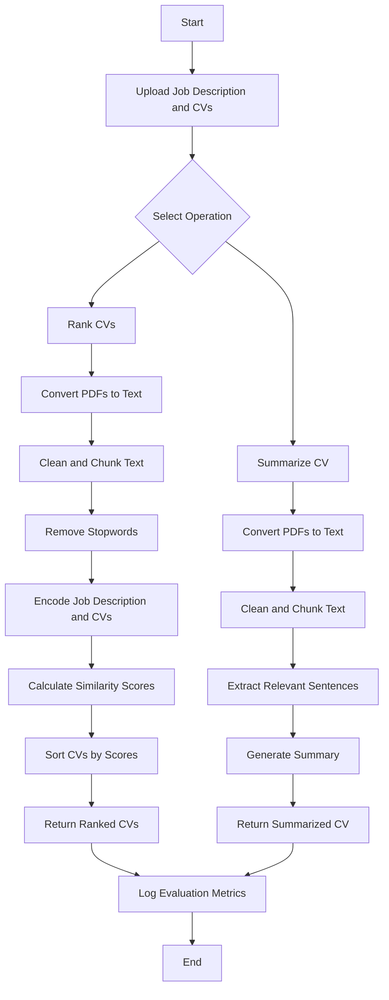

# Resume Ranking and Summarization Tool

This project provides a tool to rank and summarize CVs based on a given job description. The application is built using FastAPI for the backend, with endpoints for ranking and summarizing CVs. It also includes evaluation metrics such as MRR, NDCG, and BERTScore for performance measurement.

## Features

- **CV Ranking**: Rank CVs based on their relevance to a job description.
- **CV Summarization**: Summarize CVs to highlight relevant skills and experiences.
- **Evaluation Metrics**: Measure the performance of the ranking and summarization processes using MRR, NDCG, and BERTScore.

## Prerequisites

Before setting up the project, ensure you have the following installed:

- Python 3.7+
- pip
- Git

## Installation

1. **Clone the Repository:**

   ```bash
   git clone https://github.com/Greyisheep/resume-ranking-assessment.git
   cd resume-ranking-assessment
   ```

2. **Create and Activate a Virtual Environment:**

   ```bash
   python -m venv env
   source env/bin/activate  # On Windows: env\Scripts\activate
   ```

3. **Install the Required Dependencies:**

   ```bash
   pip install -r requirements.txt
   ```

## Running the Application

1. **Start the FastAPI Application:**

   ```bash
   uvicorn app.main:app --reload
   ```

2. **Access the API Documentation:**

   Open your browser and navigate to `http://127.0.0.1:8000/docs` to access the automatically generated API documentation.

3. **Use the Endpoints:**

   - **/rank**: Rank CVs based on a job description.
   - **/summarize**: Summarize a CV based on a job description.
  
4. **Start the Streamlit Application:**

   ```bash
   streamlit run app.py
   ```

## Project Structure

```plaintext
resume-ranking-assessment/
│
├── backend/
│   ├── __init__.py
|   ├── Dockerfile
│   ├── models.py           # Contains the models and functions for ranking and summarization
│   ├── main.py             # Entry point for the FastAPI application
│   ├── utils.py            # Utility functions for processing PDF files
|   ├── metrics.py          # Functions for calculating and logging evaluation metrics
│   └── requirements.txt   # Backend dependencies
├── frontend/
|   ├── Dockerfile
|   ├── app.py              # Streamlit frontend
│   └── requirements.txt    # Frontend dependencies
├── docker-compose.yml
└── README.md               # Project documentation
```

## Process Flow Diagram

The diagram below illustrates the detailed process flow of the application, from receiving a request to returning the ranked or summarized CVs.



## Future Improvements

- Implement additional evaluation metrics.
- Improve the robustness of the text extraction and cleaning processes.
- Implement a good database structure with postgres.
